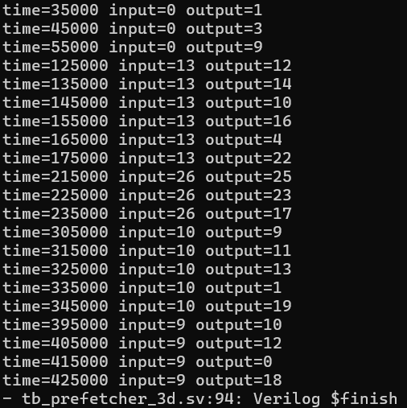
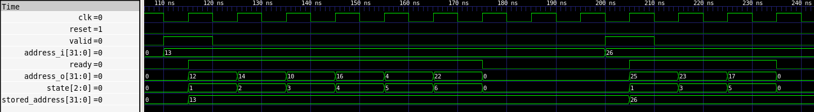
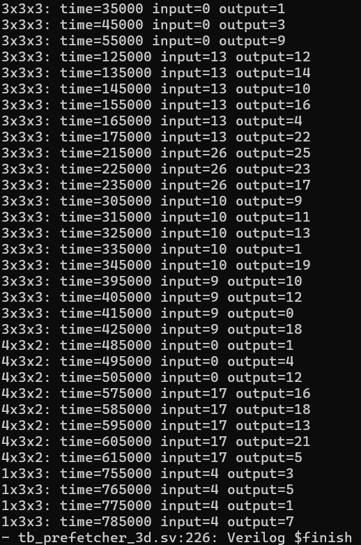
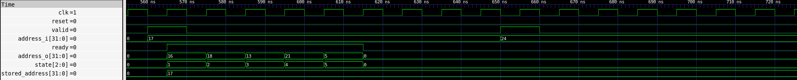
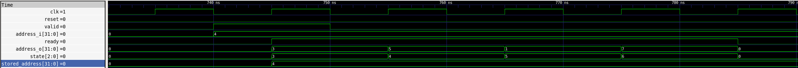

# 3D Spatial Prefetcher

## Overview

This project implements a 3D spatial prefetcher in SystemVerilog.

The prefetcher takes an address corresponding to a point in a 3D structure and outputs the addresses of all valid adjacent points, one per clock cycle.

I first implemented a fixed `3 x 3 x 3` version, then generalized it into a parameterized `X_SIZE x Y_SIZE x Z_SIZE` design.

The design was simulated using Verilator and inspected using GTKWave.

---

## Interface

| Signal | Direction | Description |
| --- | --- | --- |
| `clk` | Input | Clock |
| `reset` | Input | Resets state |
| `address_i` | Input | Input address |
| `valid` | Input | Indicates `address_i` is valid |
| `address_o` | Output | Prefetched output address |
| `ready` | Output | Indicates `address_o` is valid |

The prefetcher only accepts a new request while in `IDLE`. The accepted input address is stored internally while its neighbors are generated.

---

## Fixed 3 x 3 x 3 Design

The first version assumes addresses `0-26` arranged as:

### z = 0

```text
0  1  2
3  4  5
6  7  8
```

### z = 1

```text
9  10 11
12 13 14
15 16 17
```

### z = 2

```text
18 19 20
21 22 23
24 25 26
```

The x coordinate changes fastest, followed by y, then z.

This gives the following neighbor offsets:

```text
x neighbors: +/- 1
y neighbors: +/- 3
z neighbors: +/- 9
```

Coordinates are recovered from an address using:

```text
x = addr % 3
y = (addr / 3) % 3
z = addr / 9
```

The coordinates are used to prevent neighbors from crossing cube boundaries.

For example, address `13` is the center and produces:

```text
12, 14, 10, 16, 4, 22
```

---

## FSM Design

The prefetcher uses the following FSM:

```text
IDLE
  ->
X_MINUS
  ->
X_PLUS
  ->
Y_MINUS
  ->
Y_PLUS
  ->
Z_MINUS
  ->
Z_PLUS
  ->
IDLE
```

Each direction corresponds to one possible adjacent address.

Invalid directions are skipped, so valid outputs can be produced on consecutive cycles.

While a valid neighbor is being output:

```text
ready = 1
```

and `address_o` contains that neighbor.

---

## Storing the Input Address

A request takes multiple cycles to complete, so `address_i` may change before all neighbors are generated.

To prevent this from affecting the current request, the accepted address is copied into `stored_address`.

After leaving `IDLE`, all neighbor generation uses `stored_address` instead of the live `address_i`.

One timing issue appeared when this was first added: while still in `IDLE`, `stored_address` contains the previous value until the clock edge. To fix this, the first state decision uses `address_i` directly, while only later states use `stored_address`.

---

## 3 x 3 x 3 Verification

The original `3 x 3 x 3` version was tested with several position types:

| Input | Position | Expected Outputs |
| ---: | --- | --- |
| `0` | Corner | `1, 3, 9` |
| `13` | Center | `12, 14, 10, 16, 4, 22` |
| `26` | Corner | `25, 23, 17` |
| `10` | Face | `9, 11, 13, 1, 19` |
| `9` | Edge | `10, 12, 0, 18` |

Terminal results:



Waveform:



## Note

The original fixed `3 x 3 x 3` RTL and testbench are also kept in the repository for reference. The main Makefile builds and runs the final parameterized RTL and testbench discussed below.

---

## Parameterized Design

The design was then generalized to support:

```text
X_SIZE x Y_SIZE x Z_SIZE
```

The coordinate formulas become:

```text
x = addr % X_SIZE
y = (addr / X_SIZE) % Y_SIZE
z = addr / (X_SIZE * Y_SIZE)
```

The neighbor offsets become:

```text
x: +/- 1
y: +/- X_SIZE
z: +/- (X_SIZE * Y_SIZE)
```

Boundary checks become:

```text
X_MINUS valid if X_SIZE > 1 and x > 0
X_PLUS  valid if X_SIZE > 1 and x < X_SIZE - 1

Y_MINUS valid if Y_SIZE > 1 and y > 0
Y_PLUS  valid if Y_SIZE > 1 and y < Y_SIZE - 1

Z_MINUS valid if Z_SIZE > 1 and z > 0
Z_PLUS  valid if Z_SIZE > 1 and z < Z_SIZE - 1
```

The valid address range is:

```text
0 to X_SIZE * Y_SIZE * Z_SIZE - 1
```

Out-of-range addresses are ignored and the FSM remains in `IDLE`.

---

## Coordinate Widths

The fixed design used 2-bit x, y, and z coordinates.

For arbitrary dimensions, the required widths are calculated using `$clog2`. A minimum width of 1 bit is used so dimensions of size 1 remain valid:

```text
X_BITS = (X_SIZE <= 1) ? 1 : ceil(log2(X_SIZE))
Y_BITS = (Y_SIZE <= 1) ? 1 : ceil(log2(Y_SIZE))
Z_BITS = (Z_SIZE <= 1) ? 1 : ceil(log2(Z_SIZE))
```

The division and modulo expressions used to calculate coordinates produce wider results than the coordinate signals, so explicit sized casts are used when assigning x, y, and z (mostly to prevent Verilator warnings).

The upper-bound comparisons also use sized casts.

For dimensions of size 1, both directions on that axis are explicitly disabled. For example, if `X_SIZE = 1`, neither `X_MINUS` nor `X_PLUS` can be valid.

---

## Parameterized Verification

The parameterized design was tested with:

```text
3 x 3 x 3
4 x 3 x 2
1 x 3 x 3
```

The `4 x 3 x 2` case verifies that the original fixed offsets were fully removed.

For `4 x 3 x 2`:

```text
x offset = 1
y offset = 4
z offset = 12
```

For address `17`, the expected outputs are:

```text
16, 18, 13, 21, 5
```

The design was also tested with invalid address `24`, which correctly produced no outputs.

Terminal results:



`4 x 3 x 2` waveform:



The `1 x 3 x 3` case verifies that dimensions of size 1 are handled correctly.

For address `4`, the expected outputs are:

```text
3, 5, 1, 7
```

with no x-direction neighbors.

`1 x 3 x 3` waveform:



---

## Challenges and Design Decisions

### Understanding the Address Mapping

At first, the main question was how the prefetcher could determine 3D neighbors when the interface only provides one address and no x, y, or z coordinates.

The solution was to treat the 3D structure as a flattened array. From the linear address, the x, y, and z coordinates can be reconstructed using division and modulo operations. Then, the neighboring addresses could be found using the row and plane sizes.

### Preventing Boundary Wraparound

Simply adding and subtracting the address offsets is not enough.

For example, in the fixed `3 x 3 x 3` version, `addr - 1` normally represents `X_MINUS`. However, if the point is already at `x = 0`, subtracting 1 would wrap into a different row or plane instead of producing a real x neighbor.

I resolved this by calculating the coordinates first and using a direction only when the coordinate is within bounds.

### Producing Multiple Outputs from One Input

A single input address may have between three and six valid neighbors, but the interface only provides one `address_o`.

I used an FSM with one state for each possible direction:

```text
IDLE -> X_MINUS -> X_PLUS -> Y_MINUS -> Y_PLUS -> Z_MINUS -> Z_PLUS
```

The logic skips invalid directions, allowing valid prefetch addresses to be produced on consecutive cycles without pauses.

### Input Address Changing During Processing

One request takes several cycles to finish. Initially, using `address_i` directly for all calculations would have made the design dependent on the input remaining unchanged while the neighbors were being generated.

I added `stored_address` to latch the accepted request. Once processing begins, all output addresses are generated from this stored value instead of the live input.

### First-State Timing Bug

Adding `stored_address` introduced a more timing bug.

The first decision for the next state was initially based on `stored_address`, but that register does not receive the newly accepted `address_i` value until the rising clock edge. This meant the FSM wrongly chooses its first direction using the previous request.

I fixed this by using `address_i` directly for calculations while the FSM is in `IDLE`. After the request is latched and the FSM leaves `IDLE`, the calculations switch to `stored_address`.

### Coordinate Width and Verilator Warnings

The original design used 2-bit x, y, and z coordinates. Once the dimensions became parameters, those fixed widths were no longer sufficient.

I used `$clog2` to calculate the required coordinate width for each dimension, while forcing a minimum width of 1 bit so dimensions of size 1 remain valid.

Verilator also reported truncation and width-expansion warnings because division, modulo, and integer parameters produce wider values than the coordinate signals. Explicit sized casts were added to make those conversions intentional.

Testing a `1 x 3 x 3` configuration showed an additional unsigned-comparison warning for the size-1 dimension, so I disabled both directions on an axis when that dimension has size 1.

### Invalid Input Addresses

The original `3 x 3 x 3` implementation assumed that every input address was inside the structure.

For the parameterized design, the valid range is:

```text
0 to X_SIZE * Y_SIZE * Z_SIZE - 1
```

Without an explicit check, an out-of-range address would still be converted into coordinates and could generate meaningless outputs.

The final implementation only accepts and latches a request when the address is in range. Otherwise, the FSM remains in `IDLE` and `ready` stays low.

---

## SystemVerilog RTL

```systemverilog
// RTL
```

---

## Testbench

```systemverilog
// Testbench
```

---

## Simulation

From the `sim` directory:

```bash
make
```

The simulation generates:

```text
waveform.vcd
```

which can be opened with:

```bash
gtkwave waveform.vcd
```

---

## Final Result

The final design:

- supports arbitrary `X_SIZE x Y_SIZE x Z_SIZE` dimensions
- reconstructs 3D coordinates from a flattened address
- outputs one valid adjacent address per clock cycle
- skips invalid directions
- stores the active request internally
- supports dimensions of size 1
- rejects out-of-range addresses
- was verified using both terminal output and GTKWave waveforms
